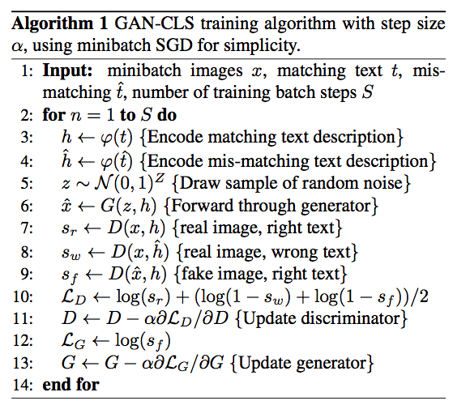
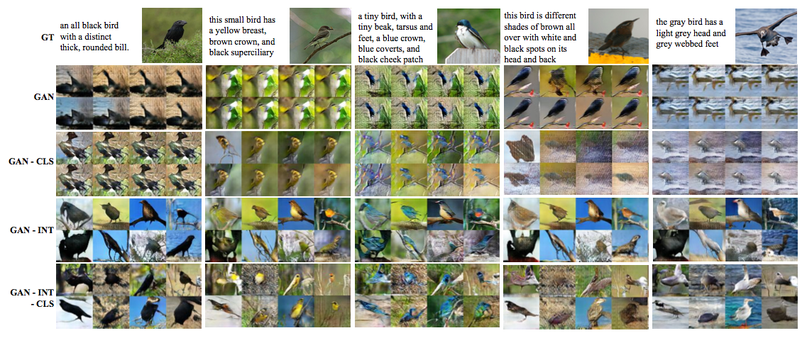
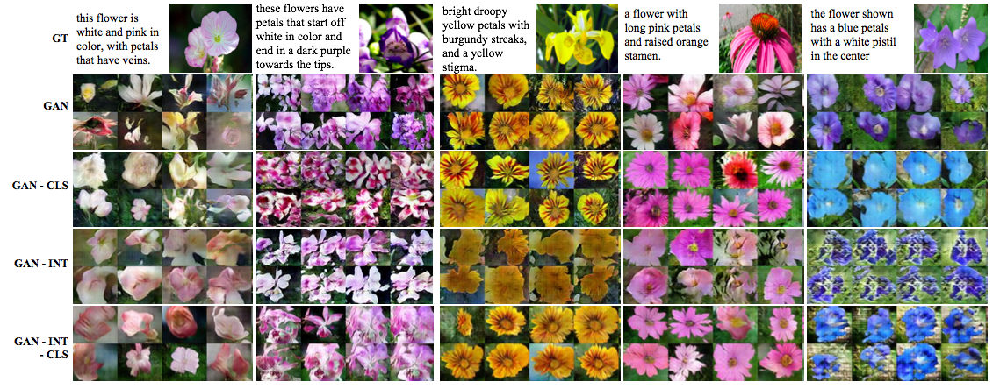
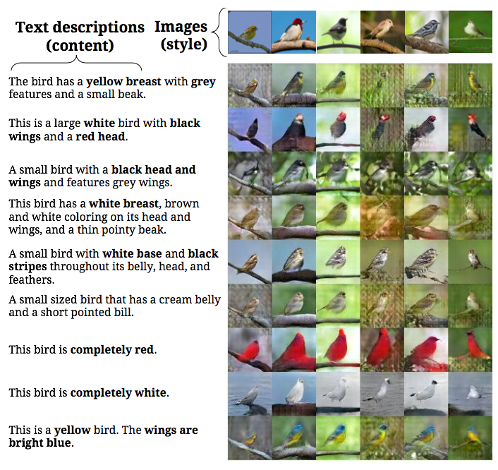
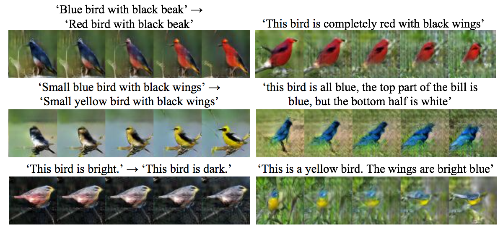

# GAN之根据文本描述生成图像

GAN[2,3]的出现使得图像生成任务有了长足的进步。一些比较好玩的任务也就应运而生，比如图像修复、图像超清化、人脸合成、素描上色等。今天我们将介绍一种更加复杂的应用，那就是基于文本生成图像。

本文是文献[1]的阅读笔记。

# 背景

首先，我们要了解GAN是什么，简而言之，GAN是一种“道高一尺魔高一丈”的博弈算法，算法分为两个模块，生成器和判别器。生成器负责生成合理的样本，判别器负责判断生成的样本合理与否。在训练过程中，生成器的目标是生成出越来越好的样本去使得判别器失效，而判别器则是要提升自己的判断能力使的不被骗。

初始的GAN是将图像和随机向量一一对应起来然后训练得到一个随机向量到图像的映射，这样，从同样的分布中随机一个其他的向量也能得到一张图像。除了这种完全依赖随机向量生成图像的模型外，还可以加入其它的条件因素构建更复杂的模型。比如素描上色，输入即是素描图像，而生成的是添加了颜色的图像。本文的算法与之类似，但这次的输入是图像以外的媒体信息——文字信息。

根据文本描述生成图像，从问题本身来看，是非常的多样化。文本中一个词语的变化可能会导致生成的图像中大量的像素发生改变。这些发生改变的像素之间的关联却很难发现。就连其其反问题图像生成文本描述就没有这样严重的问题，因为文本是可以用语言模型建模的。而GAN恰恰就能解决这样的问题。

# 模型

模型结构如下图所示。可以看到，图的左侧是生成网络，右侧是判别网络。

在生成网络中，首先需要对文本进行编码，在这里，使用了[4]中的char-CNN-RNN结构来对文本做embedding。这里，可以使用pre-train的网络直接使用提取好的embedding，也可以直接进行end2end的直接学习参数。文本编码后首先经过一个全连接层(Leaky-Relu激活)压缩到一个较小的维度(128)，然后和一个从正态分布中得到的随机向量进行拼接。然后再将其输入到一些正常的deconvolution层做图像生成。

在判别网络中，首先对输入做几个stride=2的卷积，每个卷积都带有spatial batch normalization和leaky Relu。当feature map的大小变为2x2时，则又一次对文本编码结果做一个全连接层，将全连接层的结果拼接到这个大小为2x2的feature map上。然后对拼接结果做一个1x1的卷积和2x2的卷积。在判别网络中，每层都会用batch normalization.

## 判别目标之是否匹配

根据文本生成图像是一个比较特殊的任务，在这个任务中，GAN的判别网络需要做两件事，第一件事是判断生成的图像合理与否，第二件事是判断生成的图像是否与对应的文本相匹配。

为了解决这两个目标，使用了两种手段。第一个手段是先将图像合理与否训练出来，当生成的图像足够合理之后，再训练图像与文本是否匹配。第二个手段是为了使判别模型能够拥有判断文本与图像是否匹配的能力，除了<假图，描述>和<真图，描述>外，添加第三种样本即<真图，不匹配描述>。这样，判别器就能将是否匹配的信号传递给生成器了。

加上第三种样本后，模型成为GAN-CLS。模型的训练流程如下图所示：

## 插值法学习

深度学习网络在文本领域证明了文本embedding的线性插值是比较接近文本的流形的。即两个代表不同意义的句子A和B，A和B中间意思的的句子C的embedding会和A和B分别的embedding的均值比较接近。这是一个理论上的证明，在这里就不展开细说了。大家知道有这个性质即可。

根据这个性质，那么我们可以增强我们模型的鲁棒性。即除了正常的训练数据外，我们可以使用插值法做data augmentation。这样可以使我们的模型能够在整个流形上有效。

添加这样的性质后，模型被称为GAN-INT。

## 倒转G来做风格转换

如果输入的文本包含的是图像内容信息的话，那么，可以预见，随机向量可以捕捉到一个风格因素，比如背景颜色，姿势等。如果真能如此的话，那么就意味着将不同的随机向量和文本进行组合，可以得到不同风格的图像。

为了验证这一想法，先将G倒转学习到一个从图像到随机向量的映射S。在做风格转换的时候，首先使用S提取风格图像的风格信息到一个向量a，然后将向量a和文本进行组合输入给生成器得到某风格下的图像。

# 实验

## 生成实验
在CUB数据集(花)和Oxford-102(鸟)数据集上做了实验，效果如下：

可以看到，在花的实验上，普通的GAN容易生成比较多样性的结果。

花的实验效果比鸟的要好，原因可能在于不同的鸟类之间差别比较大，容易被D区分出来，导致D提升有限，从而限制了G的提升。

## 风格转换

可以看到，大部分生成图片还是能将背景和位置从风格图片中继承下来。

## 插值图像

左侧是保持随机向量不变，两段不同的文本做插值，可以看到从左到右，逐渐接近第二句的效果。右侧是保持文本不变，两个随机向量做插值，可以看到，生成的物体没有变化，而背景却在发生渐变。

# 总结

本文描述了文本生成图像的GAN网络结构，并针对这一特殊问题，描述了多种手段。包括：

- 文本-图像匹配的目标函数
- 插值训练
- 风格转换

希望大家有所收获。

# 参考文献
- [1]. Reed, S., Akata, Z., Yan, X., Logeswaran, L., Schiele, B., & Lee, H. (2016, May 18). Generative Adversarial Text to Image Synthesis. arXiv.org.
- [2]. Goodfellow, I. J., Pouget-Abadie, J., Mirza, M., Xu, B., Warde-Farley, D., Ozair, S., et al. (2014). Generative Adversarial Nets. Nips.
- [3]. [对抗生成网络](http://blog.csdn.net/stdcoutzyx/article/details/53151038)
- [4]. Reed, S., Akata, Z., Schiele, B., & Lee, H. (2016, May 18). Learning Deep Representations of Fine-grained Visual Descriptions. arXiv.org.