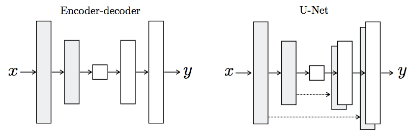

# Pix2Pix-基于GAN的图像翻译

语言翻译是大家都知道的应用。但图像作为一种交流媒介，也有很多种表达方式，比如灰度图、彩色图、梯度图甚至人的各种标记等。在这些图像之间的转换称之为图像翻译，是一个图像生成任务。

多年来，这些任务都需要用不同的模型去生成。在GAN出现之后，这些任务一下子都可以用同一种框架来解决。这个算法的名称叫做Pix2Pix，基于[对抗神经网络](http://blog.csdn.net/stdcoutzyx/article/details/53151038)实现。话不多说，先上一张图。

本文是文献[Image-to-image translation with conditional adversarial networks](https://arxiv.org/pdf/1611.07004.pdf)的笔记。

虽然论文是去年11月份的，比较古老，但作为一篇很经典的论文，值得一读。

# 引入

[卷积神经网络, CNN](http://blog.csdn.net/stdcoutzyx/article/details/41596663) 出现以来，各种图像任务都在飞速的发展。但CNN虽然能够自动学习出一些东西，仍然需要人的指导。设计对的损失函数便是其中的一种方式，对于图像翻译等图像生成任务来说，告诉CNN去学习什么非常的重要。如果告诉CNN去学习一种错误的Loss，那么也不会得到什么好的结果。以欧式距离为例，CNN学习欧氏距离就会得到一张比较模糊的图像。而对于图像翻译任务来说，我们需要让CNN学习能够输出真实的清晰的图像。

# 对抗框架

Pix2Pix框架基于GAN，如果对GAN没有了解，出门左转到[对抗神经网络](http://blog.csdn.net/stdcoutzyx/article/details/53151038)去先了解一番。

既然是基于GAN框架，那么首先先定义输入输出。普通的GAN接收的G部分的输入是随机向量，输出是图像；D部分接收的输入是图像(生成的或是真实的)，输出是对或者错。这样G和D联手就能输出真实的图像。

但对于图像翻译任务来说，它的G输入显然应该是一张图x，输出当然也是一张图y。但是D的输入却应该发生一些变化，因为除了要生成真实图像之外，还要保证生成的图像和输入图像是匹配的。于是D的输入就做了一些变动，变成了一个<x,y>的Pair。而D要判断的是这个Pair是不是真的，这样就保证了Mapping。因为不真实的图像显然不能被认同为一个Pair，所以D在判断是不是能够成为一对的时候就已经包含了要生成真实图像的信息。

当然，如果去除随机变量的输入，那么学到的模型就不能学到一个分布，而只是一个转换函数。有类似的实验在输入中仍然保持着随机向量，但是在这个框架下，随机向量会被自动的忽略掉。不过对于图像翻译来说，转换函数已然足够。

# 损失函数

依上所述，Pix2Pix的损失函数为

为了做对比，同时再去训练一个普通的GAN，即只让D判断是否为真实图像。

对于图像翻译任务而言，G的输入和输出之间其实共享了很多信息，比如图像上色任务，输入和输出之间就共享了边信息。因而为了保证输入图像和输出图像之间的相似度。还加入了L1 Loss

那么，汇总的损失函数为

# 生成网络G

正如上所说，输入和输出之间会共享很多的信息。如果使用普通的卷积神经网络，那么会导致每一层都承载保存着所有的信息，这样神经网络很容易出错，因而，使用U-Net来进行减负。

上图中，首先U-Net也是Encoder-Decoder模型，其次，Encoder和Decoder是对称的。
所谓的U-Net是将第i层拼接到第n-i层，这样做是因为第i层和第n-i层的图像大小是一致的，可以认为他们承载着类似的信息。

# 判别网络D

在损失函数中，L1被添加进来来保证输入和输出的共性。这就启发出了一个观点，那就是图像的变形分为两种，局部的和全局的。既然L1可以防止全局的变形。那么只要让D去保证局部能够精准即可。

于是，Pix2Pix中的D被实现为Patch-D，所谓Patch，是指无论生成的图像有多大，将其切分为多个固定大小的Patch输入进D去判断。

这样有很多好处：

- D的输入变小，计算量小，训练速度快。
- 因为G本身是全卷积的，对图像尺度没有限制。而D如果是按照Patch去处理图像，也对图像大小没有限制。就会让整个Pix2Pix框架对图像大小没有限制。增大了框架的扩展性。

# 训练细节

- 梯度下降，G、D交替训练
- 使用Adam算法训练
- 在inference的时候，与train的时候一样，这和传统CNN不一样，因为传统上inference时dropout的实现与train时不同。
- 在inference的时候，使用test_batch的数据。这也和传统CNN不一样，因为传统做法是使用train set的数据。
- batch_size = 1 or 4，为1时batch normalization 变为instance normalization

# 实验

## 评测

使用AMT和FCN-score两种手段来做评测。

- AMT，一种人工评测平台，在amazon上。
- FCN-8，使用预训练好的语义分类器来判断图片的可区分度，这是一种不直接的衡量方式。

## Loss function实验

使用三种不同的损失函数，cGAN, L1和cGAN+L1，得到结果如下：

可以看到，只用L1得到模糊图像，只用cGAN得到的会多很多东西。而L1+cGAN会得到较好的结果。

当然普通的GAN损失函数也被尝试。只不过这个损失函数只关注生成的图像是否真实，丝毫不管是否对应。所以训练时间长了以后会导致只输出一个图像。

## 色彩实验

衡量了不同的损失函数下生成的图像色彩与ground truth的区别。

发现，L1有更窄的色彩区间，表明L1鼓励生成的图像均值化、灰度化。而cGAN会鼓励生成的图像有更多的色彩。

## Patch对比

D是基于Patch的，Patch的大小也是一个可以调整的参数。

不同的size产生了不同的结果。1x1的patch就是基于Pixel的D，从结果上看，没带来清晰度的提升，但是却带来了更多的颜色。也证明了上一个实验的结论。

16x16的Patch已经可以达到更好的效果，但是多很多东西（一些乱七八糟的点）。70x70可以消除这些。再变大到286x286，就没有多大的效果提升了。

## U-Net

U-Net中使用了skip-connection，而使用与不使用也做了对比实验

可以看到，使用普通的Encoder-Decoder导致了很大的模糊。

# 总结

本文将Pix2Pix论文中的所有要点都表述了出来，主要包括：

- cGAN，输入为图像而不是随机向量
- U-Net，使用skip-connection来共享更多的信息
- Pair输入到D来保证映射
- Patch-D来降低计算量提升效果
- L1损失函数的加入来保证输入和输出之间的一致性。

# Reference

- [1]. Image-to-image translation with conditional adversarial networks
- [2]. [对抗神经网络](http://blog.csdn.net/stdcoutzyx/article/details/53151038)
- [3]. [卷积神经网络](http://blog.csdn.net/stdcoutzyx/article/details/41596663)